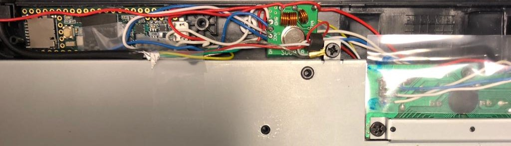
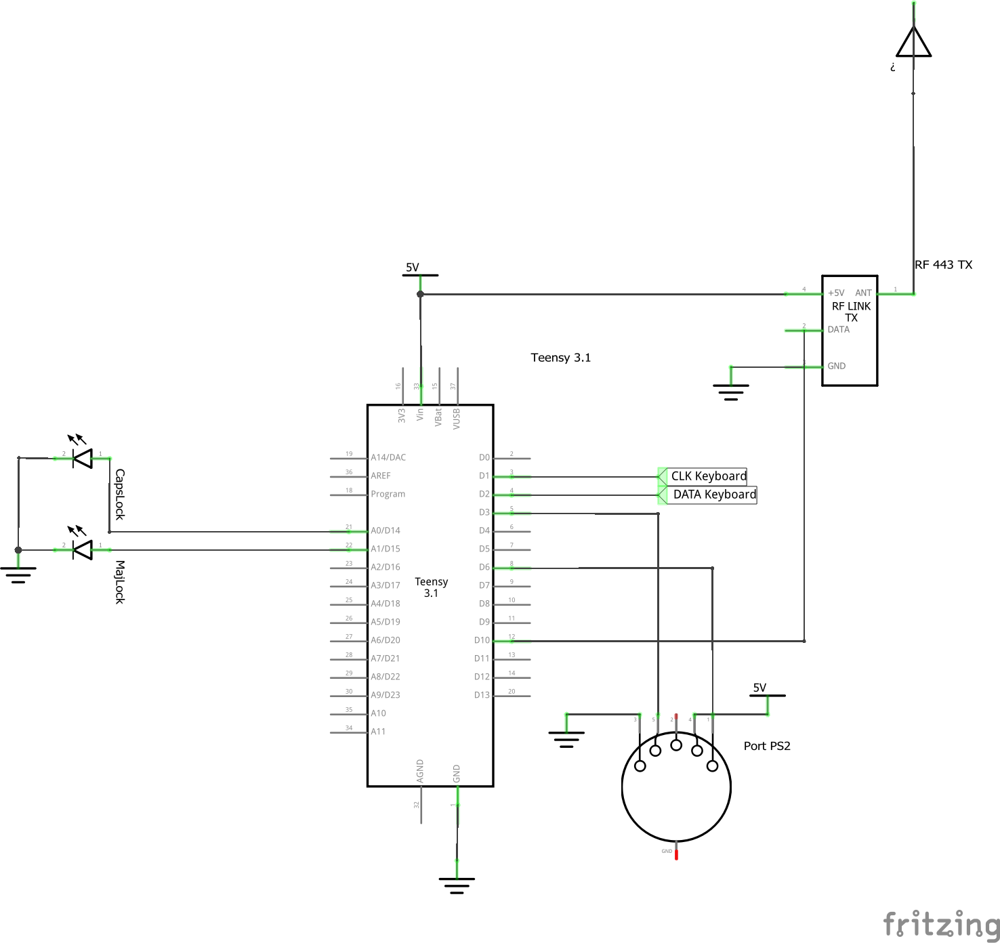

# KeyLoscopie

Full MITM beetween a PS2 keyboard and a PS2 computer. The goal of this projet is to be able to record the keypress and send then by radio.




+ The keyboard is connected to the Teensy on `CLK Keyboard` and `DATA Keyboard`
+ The computer is connected to the Teensy on port 8 and 5 of the teensy
- When a keypress is deteced from the keyboard
 * The scancode is sent to keyboard
 + The scancode is decoded to QWTERTY and sent using radio

+ The keyboard is connected to the Teensy on `CLK Keyboard` and `DATA Keyboard
+ The computer is connected to the Teensy on port 8 and 5 of the teensy
+ When a keypress is deteced from the keyboard:
  - The scancode is sent to keyboard
  - The scancode is decoded to QWTERTY and sent using radio
  - If the ketpress is Majlock or Numlock
    * The coresponding led is turn on

Please note than the led is not controled using the ketboard library, and it not syncronized with the real state on the computer.
Usaly the computer send a code informing the ketboard of the leds state. In our case the full mitm block tha signal and the ketboard dont know about the state on Maj and Num leds. So by detecting when the num lock and caps lock are sent to the computer we trick the user by turning on or off the leds. Quick and dirty

## Requirement

- Arduino software
- Library
  - [ps2dev](https://github.com/Harvie/ps2dev)
  - [Ps2KeyboardHost](https://github.com/SteveBenz/PS2KeyboardHost)
- Teensy 3.X
- A PS2 Keyboard
- 2 LEDS




## Edit

For the project to work you have to edit the PS2Dev Library
`Arduino\libraries\ps2dev\src\ps2dev.cpp`
```c
int PS2dev::keyboard_mkbrk(unsigned char code)
{
  write(code);
//  write(0xF0);
//  write(code);
  return 0;
}
```
## Contribute 

Don't hesitate to praticipate and reuse this code.

## Disclamer

All information and software available on this repository are for educational purposes only. Use these at your own discretion, we cannot be held responsible for any damages caused. Usage of this tools on this repository for attacking targets without prior mutual consent is illegal. It is yours responsibility to obey all applicable laws. We assume no liability and are not responsible for any misuse or damage caused.

## Contributor

[@torreantoine](https://github.com/torreantoine/) [@CustomBread](https://github.com/CustomBread/)

## Special thanks

[@Harvi](https://github.com/Harvie/) and [@SteveBenz](https://github.com/SteveBenz) for the amazing libs.
